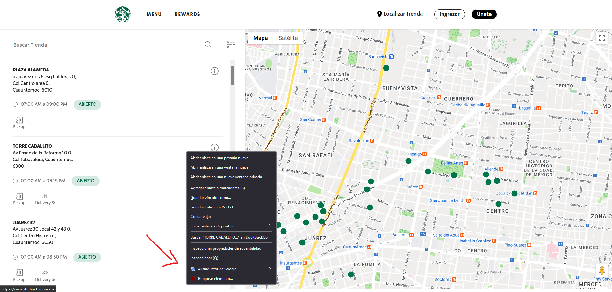
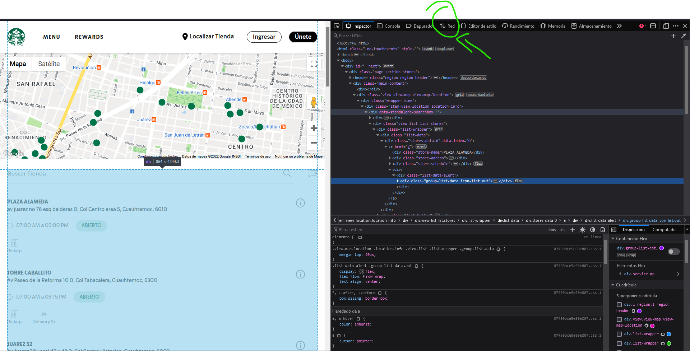
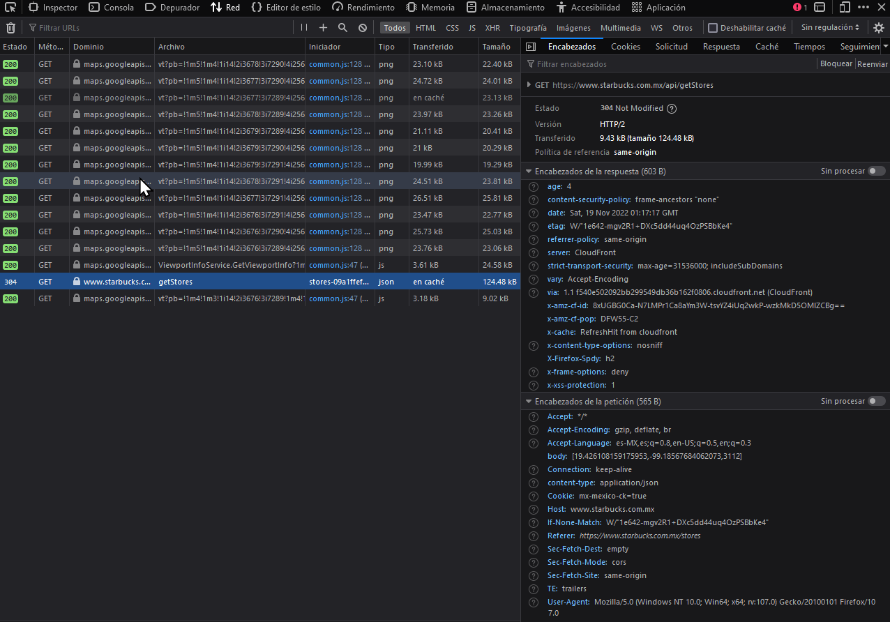
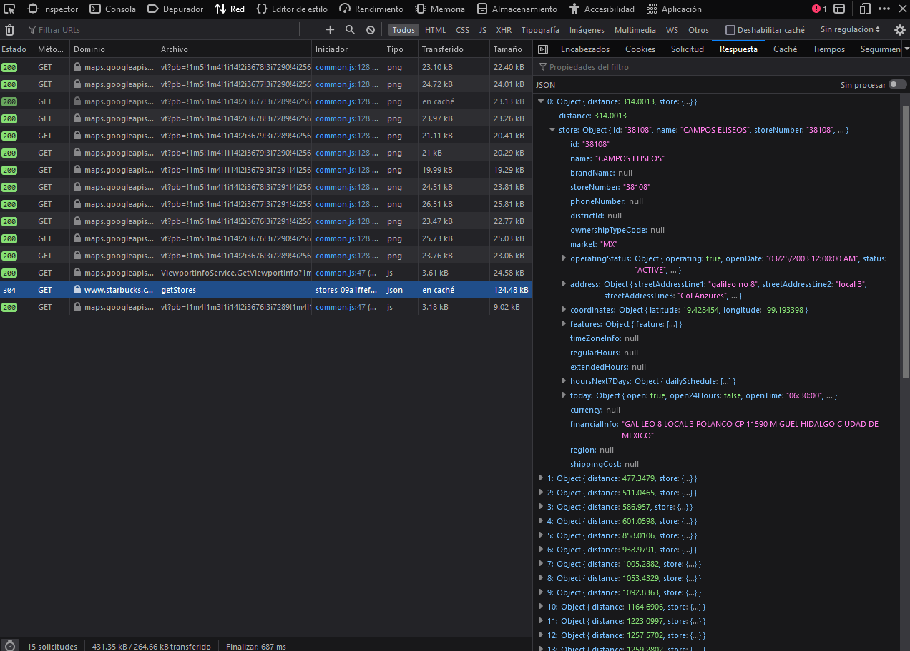
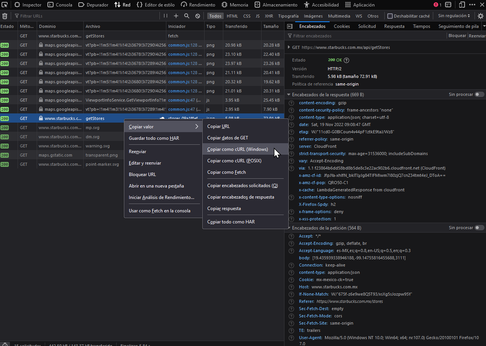
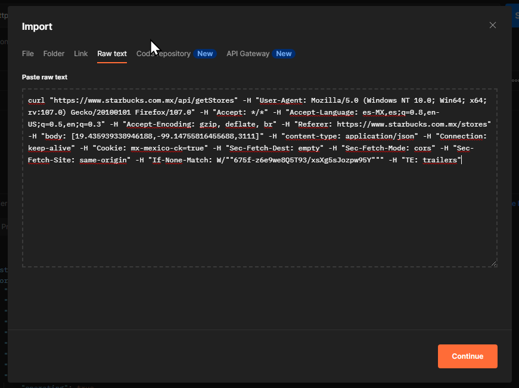
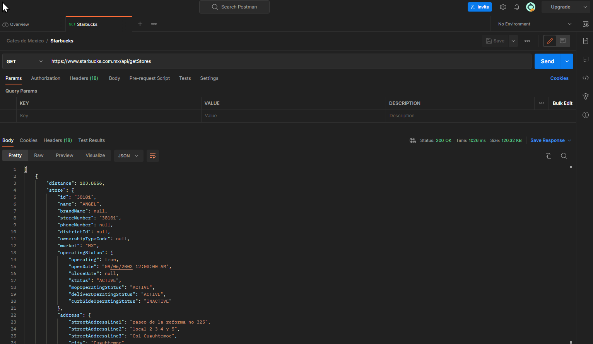
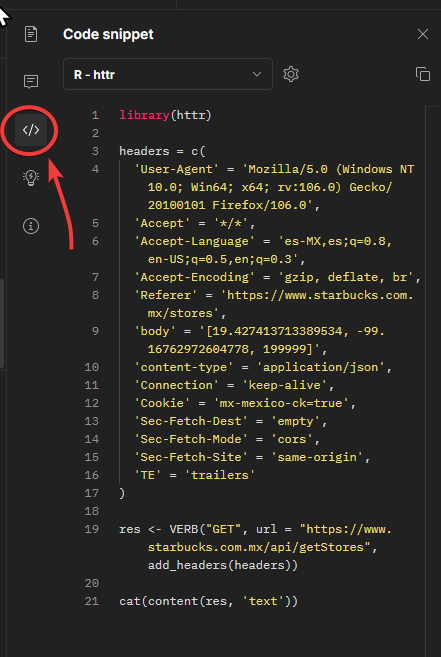

Starbucks en México mediante API no-oficial
================
Sebastián Quintana Rosas
5 de Noviembre 2022

## Planteamiento del problema

Deseamos conocer, con íntimo detalle, acerca de los cafés pertenecientes
a la franquicia Starbucks que se encuentran asentados en la República
Mexicana.

¿Cómo podemos acceder a esa información desde la misma Starbucks?

La respuesta no es tan complicada. A través de su propio sitio web,
<https://www.starbucks.com.mx/stores>, podemos obtener la información
deseada y tal vez más.

## Abriendo la *‘Consola’*

Bien, primero que nada, nos posicionaremos la página antes mencionada y
daremos click derecho en cualquier parte para abrir el menú contextual y
seleccionaremos “Inspeccionar”.



Nuestro navegador abrirá el Inspector de Página, comúnmente usado por
desarrolladores web, que nos permite visualizar el código HTML y otros
scripts que intervienen en nuestro sitio web. Procedemos a escoger la
pestaña que se llama *“Red”* o *“Tráfico”,* dependiendo de nuestro
navegador.



La pestaña de Red permite visualizar todas las conexiones e intercambios
de información que se realizan al cargar o interactuar con algún objeto
de la página web. Es aquí donde podemos observar como el sitio web
efectúa una llamada GET a una API para obtener la información de las
tiendas en función de ciertos parámetros.



Del lado derecho se observa que hay más pestañas tales como Encabezados,
Cookies, Solicitud, Respuesta, etc. Para nuestros propósitos nos
interesan las pestañas de **Encabezados** y **Respuesta**.

El apartado de Encabezados nos muestra toda la información con la que se
realiza la solicitud, si prestamos atención podemos observar que hay una
URL peculiar con la que se comunica:

`GET    https://www.starbucks.com.mx/api/getStores`

Y dentro de sus parámetros, en **body**, tiene los siguiente:

`[19.426108159175953,-99.18567684062073,3112]`

Con esto podemos inferir que existe una llamada a una API de
localización que utiliza como parámetros de entrada las coordenadas
geográficas de un punto en particular, obtenidas a través del mapa
interactivo de Google, para regresar una lista de los establecimientos
dentro de un radio.

Si exploramos la pestaña de Respuesta, se observa que hay una lista de
50 elementos en formato JSON y al desglosarla se muestran todos los
elementos que devuelve.



## Llegada del *Cartero…*

El sitio web [Postman](https://www.postman.com/) permite a sus usuarios
construir y desarrollar API’s en la nube, sin necesidad de software
adicional y con potentes herramientas para trabajar en equipo. Este
sitio también ofrece facilidades para transformar llamadas de API en
lineas de código de algún lenguaje de programación.

De vuelta en nuestra Consola del navegador, daremos clic derecho en la
linea que contiene la llamada y la respuesta en formato JSON. Elegimos
la opción de copiar el valor “como cURL (Windows)” o el que esté
presente, pero que sea cURL, al cortapapeles.



Después de crear una cuenta en Postman y configurar nuestro primer
espacio de trabajo, daremos clic en *Import*, elegimos la pestaña de
“raw text” y pulsamos Continuar. Este proceso nos permite crear la
llamada GET dentro del entorno de Postman y es más fácil de manipular
que código “crudo” en otro entorno de desarrollo.



Postman logra nuestro acometido y genera una llamada GET que nos permite
introducir tantos parámetros y encabezados como queramos. Realizamos una
prueba al dar clic en *Send* y obtenemos lo siguiente:



Observamos que en el panel inferior, la pestaña *Body* nos muestra una
respuesta en formato JSON y al explorarlo podemos discernir que,
efectivamente, hemos obtenido un listado de establecimientos de la marca
Starbucks.

Ahora, con el fin de trabajar esta API dentro de RStudio y con el
lenguaje R, nos desplazamos a la barra lateral derecha y damos clic en
el ícono de *Code*. Un panel se hace visible, mostrando una muestra de
código que permite invocar esta misma llamada GET. Nos aseguramos de que
en la lista desplegable esté marcada con “R-httr” porque es la
biblioteca y lenguaje que vamos a emplear.



Como recordatorio, las variables que intervienen en esta API son las
siguiente:

- Latitud

- Longitud

- Radio de búsqueda en metros

``` r
# Las bibliotecas que usaremos
library(tidyverse)
library(httr)
library(jsonlite)
library(glue)
```

``` r
headers = c(
  'User-Agent' = 'Mozilla/5.0 (Windows NT 10.0; Win64; x64; rv:106.0) Gecko/20100101 Firefox/106.0',
  'Accept' = '*/*',
  'Accept-Language' = 'es-MX,es;q=0.8,en-US;q=0.5,en;q=0.3',
  'Accept-Encoding' = 'gzip, deflate, br',
  'Referer' = 'https://www.starbucks.com.mx/stores',
  'content-type' = 'application/json',
  'Connection' = 'keep-alive',
  'Cookie' = 'mx-mexico-ck=true',
  'Sec-Fetch-Dest' = 'empty',
  'Sec-Fetch-Mode' = 'cors',
  'Sec-Fetch-Site' = 'same-origin',
  'TE' = 'trailers'
)
# Definimos las variables que usan: coordenadas y radio de busqueda
crds <- "31.835855118041227,-116.59706881031494"
radio <- "200000"

# Contruimos la llamada GET
res <- GET(url = "https://www.starbucks.com.mx/api/getStores",
           add_headers(headers,body = glue("[{crds},{radio}]") ))

sbcks <- as_tibble( fromJSON(content(res, 'text'), flatten = TRUE) )
sbcks
```

    ## # A tibble: 28 × 44
    ##    distance store.id store.name  store…¹ store…² store…³ store…⁴ store…⁵ store…⁶
    ##       <dbl> <chr>    <chr>       <lgl>   <chr>   <chr>   <lgl>   <lgl>   <chr>  
    ##  1    1821. 38450    MACROPLAZA… NA      38450   <NA>    NA      NA      MX     
    ##  2    3984. 38265    ENSENADA M… NA      38265   <NA>    NA      NA      MX     
    ##  3   73659. 38763    ROSARITO    NA      38763   <NA>    NA      NA      MX     
    ##  4   79774. 38412    MACROPLAZA… NA      38412   <NA>    NA      NA      MX     
    ##  5   81704. 38922    PLAZA PENI… NA      38922   ""      NA      NA      MX     
    ##  6   82593. 38779    RIO TIJUANA NA      38779   <NA>    NA      NA      MX     
    ##  7   83334. 38667    HIPODROMO … NA      38667   <NA>    NA      NA      MX     
    ##  8   83598. 38383    GALERIAS H… NA      38383   <NA>    NA      NA      MX     
    ##  9   84147. 38848    ALAMEDA OT… NA      38848   <NA>    NA      NA      MX     
    ## 10   84345. 38737    OTAY        NA      38737   <NA>    NA      NA      MX     
    ## # … with 18 more rows, 35 more variables: store.timeZoneInfo <lgl>,
    ## #   store.regularHours <lgl>, store.extendedHours <lgl>, store.currency <lgl>,
    ## #   store.financialInfo <chr>, store.region <lgl>, store.shippingCost <lgl>,
    ## #   store.operatingStatus.operating <lgl>,
    ## #   store.operatingStatus.openDate <chr>,
    ## #   store.operatingStatus.closeDate <lgl>, store.operatingStatus.status <chr>,
    ## #   store.operatingStatus.mopOperatingStatus <chr>, …

Lo anterior describe un nuevo problema que debemos resolver. ¿Qué lista
de coordenadas vamos a utilizar para iterar nuestra API y generar
nuestro conjunto de datos Starbucks?

El alcance de esta pregunta es sumamente extenso. Podríamos intentar
conseguir las coordenadas de todas las capitales de México y trabajar
desde ahí, pero esto no garantiza que obtengamos todos los resultados ya
que puede haber presencia en otras ciudades no capitales. Por lo tanto,
debemos obtener las coordenadas de todos los asentamientos urbanos de la
República y lo podemos lograr gracias a que el Instituto Nacional de
Estadística, Geografía e Informática (INEGI) tiene catalogado esa y
mucha más información.

## Retorno al INEGI, el viejo confiable.

*El Servicio Web del Catálogo Único de Claves Geoestadísticas, permite
consultar la información con la codificación de cada área
geoestadística, con la identidad única y específica del espacio
geográfico que ocupa en el país, situación que permite la asociación de
los datos estadísticos que contiene y el reconocimiento de las unidades
geográficas por diferentes usuarios y la integración de información de
diversas fuentes.*

Esta descripción, la cual se encuentra en [Servicio Web del Catálogo
Único de Claves Geoestadísticas
(inegi.org.mx)](https://www.inegi.org.mx/servicios/catalogounico.html),
ilustra las particularidades de la herramienta que usaremos para
conseguir nuestras coordenadas.

De acuerdo a la documentación presente y la jerarquía establecida,
nuestro flujo de trabajo será el siguiente:

1.  Obtener las Claves Geoestadísticas de todos los estados de la
    República.

    ``` r
    # Consigamos primero los estados y sus claves
    flux <- GET(url = "https://gaia.inegi.org.mx/wscatgeo/mgee/")

    ts <-as_tibble( fromJSON( content(flux,"text") ) )

    #Tabla con codigo y nombre del estado
    AGEE <- ts %>% mutate(metadatos=NULL, numReg=NULL) %>% unnest(cols = datos) %>%                transmute(cve_agee, nom_agee) %>% 
                   rename(id=cve_agee, estado=nom_agee)
    ```

    ``` r
    # Para simplificar el código, guardaremos las url en diferentes variables
    link_municipio <- "https://gaia.inegi.org.mx/wscatgeo/mgem/"
    link_localidad <- "https://gaia.inegi.org.mx/wscatgeo/localidades/"
    ```

2.  Utilizando lo anterior, obtener las Claves Geoestadísticas de todos
    los municipios.

    ``` r
    # Ahora debemos construir la iteracion que va a conseguir todas los municipios de la República
    id_estados <- AGEE$id # Depositamos todos los id de los estados en una variable

    assign("AGEM", tibble(id_estados, y=NA) )
    for (i in 1:length(AGEE$id)) {

    flux <- GET( url = glue(link_municipio, id_estados[i]) )
      ts <- as_tibble(fromJSON(content(flux,"text")))
        AGEM[i,2] <- ts %>% mutate(metadatos=NULL, numReg=NULL) %>%
                     unnest(cols = datos) %>% 
                     transmute(cve_agee, cve_agem, nom_agem) %>%
                     rename(estado=cve_agee, agem=cve_agem, municipio=nom_agem) %>%
                     nest(mcp=c(estado:municipio))
    }
    AGEM_total <- AGEM %>% unnest(cols = y, keep_empty = TRUE) %>%
                           mutate(id_estados=NULL)
    AGEM_total
    ```

        ## # A tibble: 2,475 × 3
        ##    estado agem  municipio          
        ##    <chr>  <chr> <chr>              
        ##  1 01     001   Aguascalientes     
        ##  2 01     002   Asientos           
        ##  3 01     003   Calvillo           
        ##  4 01     004   Cosío              
        ##  5 01     005   Jesús María        
        ##  6 01     006   Pabellón de Arteaga
        ##  7 01     007   Rincón de Romos    
        ##  8 01     008   San José de Gracia 
        ##  9 01     009   Tepezalá           
        ## 10 01     010   El Llano           
        ## # … with 2,465 more rows

3.  Finalmente, conseguiremos todas las Localidades del país.

    ``` r
    # Ahora se construye la que va a conseguir todas las localidades
    assign("LOCALIDAD", tibble(AGEM_total, y=NA))

    for (i in 1:length(LOCALIDAD$agem)) {
    flux <- GET(url= glue(link_localidad, AGEM_total[[i,1]],"/", AGEM_total[[i,2]]))
      ts <- as_tibble(fromJSON(content(flux,"text")))
        LOCALIDAD[i,4] <- ts %>% mutate(metadatos=NULL, numReg=NULL) %>%
                                 unnest(cols = datos) %>%
                                 transmute(nom_loc, ambito, latitud, longitud) %>%
                                 rename(Localidad = nom_loc) %>%
                                 nest(mcp=everything())
    }
    LOCALIDAD_total <- LOCALIDAD %>% unnest(cols = y, keep_empty = TRUE)
    ```

Con la tabla “LOCALIDAD_total” preparada se puede proceder a iterar la
API de Starbucks. No obstante, debemos considerar que existen alrededor
de 300 mil registros en esa tabla, por lo tanto, con el propósito de
volver el proceso eficiente y más preciso, debemos reducir de alguna
forma ese número.

Afortunadamente existe una solución innata en el conjunto de datos. La
columna *ambito* nos indica si la localidad registrada es **URBANO** o
**RURAL.** Con este atributo podemos filtrar nuestros datos y dejar
fuera a las localidades que se consideran rurales, todo esto bajo la
premisa de que una franquicia como lo es Starbucks solo estaría presente
en ciudades y no en pueblos.

Filtraremos las localidades tipo **URBANO,** aislaremos las variables de
latitud y longitud para después concatenar ambas en una solo columna
llamada “coordenadas”.

``` r
# Usaremos solo los ambitos URBANOS en nuestra busqueda de Starbucks 
urbes <- LOCALIDAD_total %>% filter(ambito=="URBANO") %>% 
                             select(latitud,longitud) %>%
mutate(coordenadas=paste(latitud,longitud, sep = ","), latitud=NULL, longitud=NULL)
```

## Iteración de la API

Ha llegado el momento de construir nuestra función para llamar a la API
y depositar la respuesta que obtengamos en una columna anidada para su
posterior desglose y limpieza.

El código siguiente ilustra la función que vamos a emplear. Observamos
que para el radio de búsqueda hemos optado por usar el máximo de 199,999
metros.

``` r
STARBUCKS <- function(coordenadas) {
  
  res <- GET(url = "https://www.starbucks.com.mx/api/getStores",
             add_headers(headers,body = glue("[{coordenadas},199999]") ))
  flow <- as_tibble( fromJSON(content(res, 'text'), flatten = TRUE) )
  
  return(flow)
}
```

El bucle a emplear es sencillo. Se llama a la API, se anida toda la
respuesta y se deposita en el objeto “CAFES”.

``` r
# Creamos un objeto vacio tipo-lista "CAFES" 
assign("CAFES", list())

for (i in 1:length(urbes$coordenadas)) {
  CAFES[i] <- STARBUCKS(urbes[[i,1]]) %>% nest(data=everything())
}
```

Dado la magnitud de los datos (4911 pares de coordenadas) y una
velocidad promedio de respuesta de 0.5 segundos entre cada llamada,
nuestro bucle tardará aproximadamente 41 minutos en conseguir todos los
registros.

Cuando haya terminado se procede a desanidar todas las listas

``` r
CAFES_df <- CAFES %>% enframe(name = NULL) %>% unnest(cols=value) %>% unnest(cols=value)
```

Debemos notar que adentro de toda nuestra información, existen un par de
columnas que tienen datos anidados. Estas variables registran el tipo de
servicios o comodidades con las que cuenta cada sucursal en formato de
Codigo-Nombre. Extraeremos estas columnas y las desanidaremos para
archivarlas en una segunda tabla con el fin de usarlas en un futuro.

``` r
features <- CAFES_df %>% distinct(store.id, .keep_all = TRUE) %>% 
            unnest_wider(col = store.features.feature) %>% 
            rename(feature.code = code, feature.name = name) %>% 
            select(feature.code, feature.name) %>% 
            unnest(cols = c(feature.code, feature.name)) %>% 
            distinct(feature.code, feature.name)
```

Una tercera tabla es necesaria para complementar al paso anterior. Se
debe almacenar una lista con los servicios que tiene cada
establecimiento para relacionarlos en un futuro dentro del modelo de
datos.

``` r
tiendas_features <- CAFES_df %>% distinct(store.id, .keep_all = TRUE) %>% 
                    transmute(store.id, store.features.feature) %>% 
                    unnest_wider(col = store.features.feature) %>% 
                    rename(feature.code = code, feature.name = name) %>% 
                    unnest(cols = c(feature.code, feature.name))
```

Ahora, procedemos a limpiar y transformar nuestros datos:

``` r
# Quitamos las columnas que no nos interesan
CAFES_df_final <- CAFES_df %>% transmute(store.id,store.address.city, store.coordinates.latitude,store.coordinates.longitude, store.name, store.financialInfo, store.operatingStatus.openDate,store.operatingStatus.status, store.address.city, store.address.countrySubdivisionCode)

# Filtramos para obtener los valores unicos de store.id y asi eliminar duplicados
CAFES_df_final <- CAFES_df_final %>% distinct(store.id, .keep_all = TRUE)
```

Finalmente, es conveniente transcribir nuestros resultados a un archivo
CSV para almacenarlo y tenerlo listo para futuros análisis.

`write_excel_csv(CAFES_df_final, "STARBUCKS_en_Mexico.csv")`

`write_excel_csv(features, "servicios_starbucks.csv")`

`write_excel_csv(tiendas_features,"tiendas_servicios_starbucks.csv")`

El archivo final puede ser consultado aquí:
<https://drive.google.com/file/d/1yNZe6RvtK8jlDDLHPQUSRodCwCwrOKGf/view?usp=share_link>

## FIN
